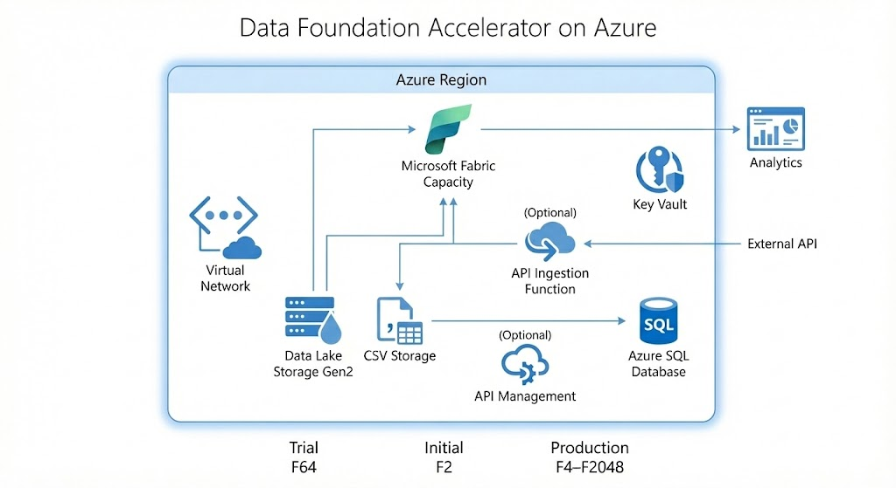
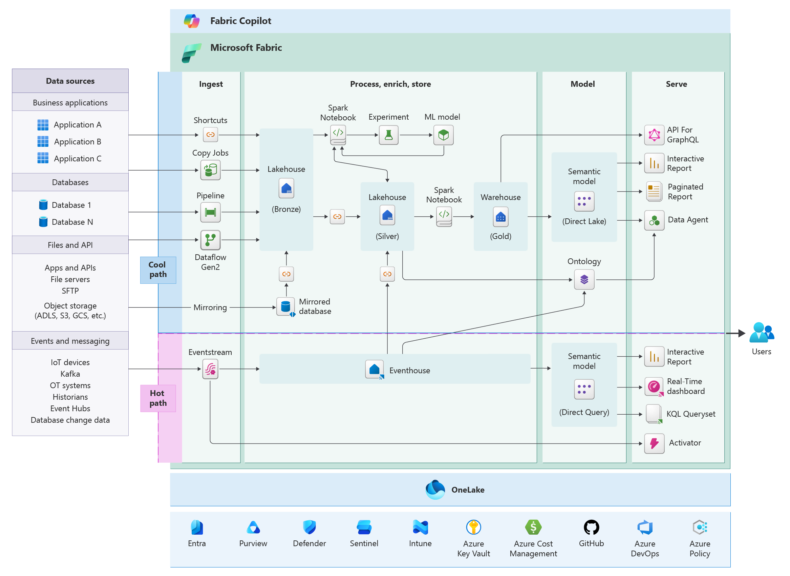

## Overview

The Data Foundation Accelerator deploys the current baseline Azure footprint
for a governed data foundation. The repository documentation describes the
topology that ships today.



## Deployed Topology

### Fabric Capacity

- `none`: no Fabric capacity resource is deployed by the template
- `initial`: deploys a new `F2` capacity
- `production`: deploys a new `F4` capacity by default, with optional source
  deployment override up to `F2048`
- Optional Fabric capacity administrators can be supplied when a new capacity
  is created



### Network

- One virtual network with a template-defined address space of `10.0.0.0/16`
- One default subnet at `10.0.1.0/24`
- One private endpoints subnet at `10.0.2.0/24`
- Private endpoints are controlled by a single deployment flag

### Storage

- One Azure Data Lake Storage Gen2 account
- Five containers created by default: `raw`, `ingestion`, `archive`,
  `function-host`, and `function-data`
- The same storage account supports file landing patterns and the optional API
  ingestion Function App

### Security And Configuration

- Azure Key Vault for deployment and application secrets
- Optional Defender for Cloud configuration at the subscription scope
- Customer contact fields collected in the deployment UX for installation
  tracking

### Relational And API Services

- Azure SQL Server and Azure SQL Database
- Optional API ingestion Function App with `EXTERNAL_API_BASE_URL`
- Optional API Management instance for downstream governance

## Data Flow

### Ingestion Path

```text
External source
    ↓
API ingestion Function (optional)
    ↓
ADLS Gen2 (`raw` or `ingestion`)
    ↓
Fabric pipelines or downstream processing
    ↓
Azure SQL Database and analytics consumers
```

### Consumption Path

```text
ADLS Gen2 / Fabric-managed data
    ↓
Fabric and Power BI workloads
    ↓
Optional API Management
    ↓
Downstream applications and services
```

## Current Configuration Notes

- A Fabric trial is never provisioned by the ARM template. Use the Fabric
  portal separately when `deploymentTier` is `none`.
- Subnet ranges are fixed in the current template and are not exposed as user
  inputs in the marketplace UX.
- When private endpoints are enabled, storage, SQL, and Key Vault shift to
  private connectivity patterns that also depend on DNS configuration.
- When Defender for Cloud configuration is enabled, pricing plan changes apply
  to the subscription, not only to the deployed resource group.

